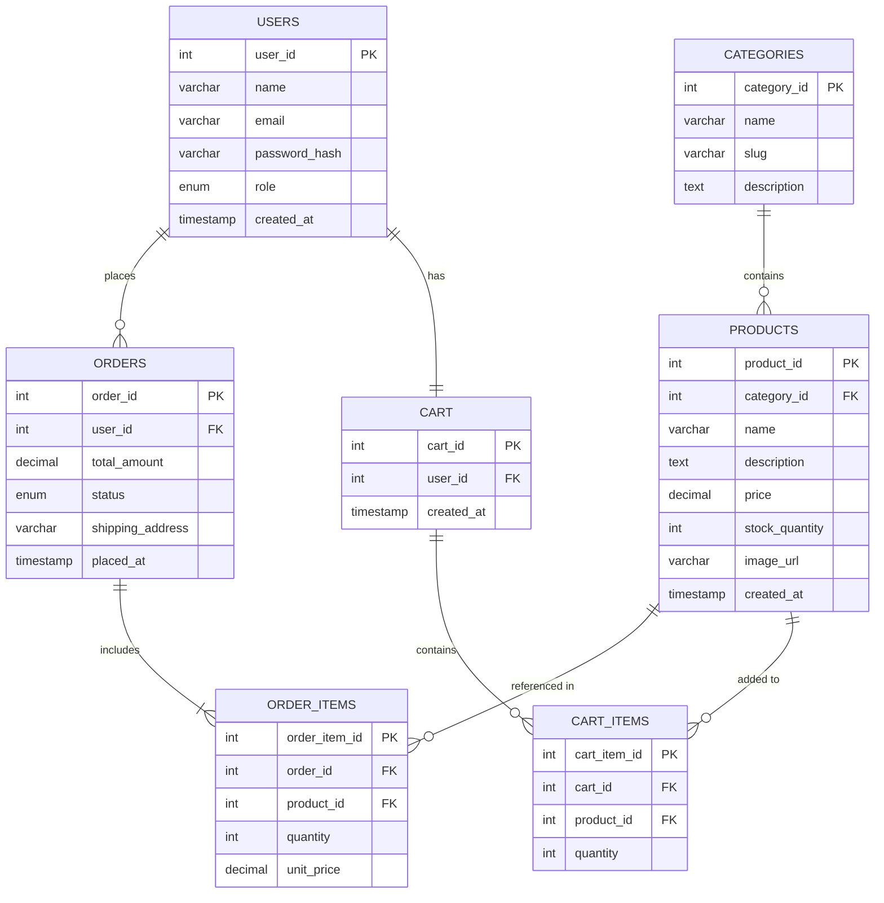

#Sprint 1 — Planning & Architecture Definition
### E-Commerce Web Application | SDLC Assignment

---

## 1. Target Audience & Market Focus

### User Persona

The primary users of this platform are **young adults between the ages of 18 and 35** — mostly university students and early-career professionals — who are comfortable shopping online but frustrated by cluttered, slow, or confusing e-commerce experiences. They want something simple, fast, and trustworthy.

A typical user might be a university student looking to buy electronics, clothing, or everyday essentials without the hassle of visiting a physical store. They usually shop from their phone, care about transparent pricing, and want to know their order status without having to call anyone.

### Core Problem Being Solved

Most existing e-commerce platforms are either too complex (like large marketplaces with thousands of sellers and overwhelming UI) or too limited (like small local stores with no proper tracking or cart management). This platform aims to sit in the middle — clean UI, reliable order tracking, secure checkout, and easy product discovery — without unnecessary complexity.

### Market Vertical

This application targets the **general consumer retail** vertical, with an initial focus on everyday products across categories like electronics, fashion, and home goods. The long-term goal is to support multiple vendors, but Sprint 1 scope is limited to a single-vendor model to keep the architecture manageable and deliverable within the course timeline.

---

## 2. MVP Feature Scope

The following 5 core features have been selected for the Minimum Viable Product. These are the features that must work end-to-end before anything else is added.

| # | Category | Feature | Description | Priority |
|---|----------|---------|-------------|----------|
| 1 | User Management | User Registration & Login | Users can sign up with email and password, log in securely, and maintain a session. Passwords are hashed before storage. | High |
| 2 | Product Catalog | Browse & Search Products | Users can view a paginated product listing, filter by category, and search by keyword. Each product has a name, description, price, and stock count. | High |
| 3 | Shopping Cart | Add to Cart / Manage Cart | Logged-in users can add products to a persistent cart, update quantities, and remove items. Cart state is saved to the database. | High |
| 4 | Order Management | Place & Track Orders | Users can convert their cart into an order, view their order history, and see the current status (Pending, Processing, Shipped, Delivered). | High |
| 5 | Admin Panel | Product & Order Administration | An admin user can add, edit, or delete products and can update the status of any order through a separate admin dashboard. | Medium |
| 6 | Category Management | Organize Products by Category | Products are organized under categories. Admins can create and manage categories. Users can filter the product listing by category. | Medium |

---

## 3. Tech Stack Selection & Justification

The stack was chosen with simplicity, developer productivity, and real-world relevance in mind. Avoiding over-engineering was a deliberate decision — the goal is a working, deployable product, not a showcase of trendy tools.

### Frontend — React.js (with Vite)

**Justification:** React is the most widely used frontend library right now and for good reason — its component-based structure makes it easy to build reusable UI pieces like product cards, modals, and navigation bars. Vite is used as the build tool instead of the older Create React App because it is significantly faster during development. For styling, Tailwind CSS will be used since it avoids writing custom CSS from scratch while still allowing full design control.

### Backend — Node.js with Express.js

**Justification:** Node.js with Express keeps the stack in one language (JavaScript) across both frontend and backend, which reduces context-switching and makes the codebase easier to maintain as a solo developer. Express is lightweight and does not force any particular folder structure, which gives enough flexibility to organize the API in a RESTful way without boilerplate overhead. JWT (JSON Web Tokens) will be used for stateless authentication.

### Database — PostgreSQL

**Justification:** This application has clearly relational data — users have orders, orders have items, items belong to products, products belong to categories. A relational database like PostgreSQL is the right tool here. It enforces referential integrity through foreign keys, supports ACID transactions (important for order placement), and scales well. PostgreSQL is also free, open-source, and has excellent support via Supabase for hosting. An ORM (Prisma) will be used on top to avoid writing raw SQL for most queries.

### Optional — Redis (Caching)

**Justification:** Redis will be used optionally for caching frequently accessed data like the product listing and category list. These endpoints are hit on every page load, so caching them with a short TTL (30-60 seconds) can reduce database load significantly. This is not a core MVP requirement but is worth noting as part of the architecture plan.

---

## 4. Entity-Relationship Diagram (ERD)

The schema below covers all required entities: **Users**, **Products**, **Categories**, **Orders**, **Order_Items**, **Cart**, and **Cart_Items**. Relationships and cardinalities are shown using Mermaid ER diagram syntax.

### Schema Notes

- **`USERS.role`** is an enum with values `customer` and `admin`, used to gate access to the admin panel.
- **`ORDERS.status`** is an enum with values `Pending`, `Processing`, `Shipped`, `Delivered`, and `Cancelled`.
- **`ORDER_ITEMS.unit_price`** stores the price at the time of purchase, not the current product price. This ensures historical order data stays accurate even if prices change later.
- Each user has exactly **one cart** (1-to-1 relationship). Cart items are cleared once an order is placed.
- A product can belong to **only one category**, but a category can have **many products** (many-to-one).
- Foreign key constraints are enforced at the database level to maintain referential integrity.

---

*Prepared for: Software Engineering / SDLC Course — Sprint 1 Submission*
*Sprint Focus: Planning & Architecture Definition*
